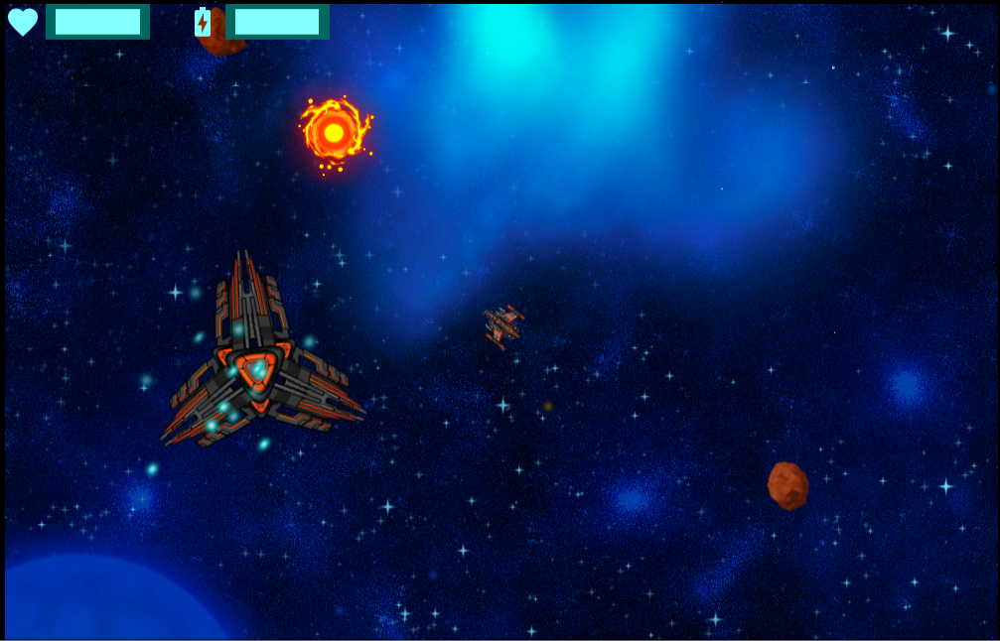
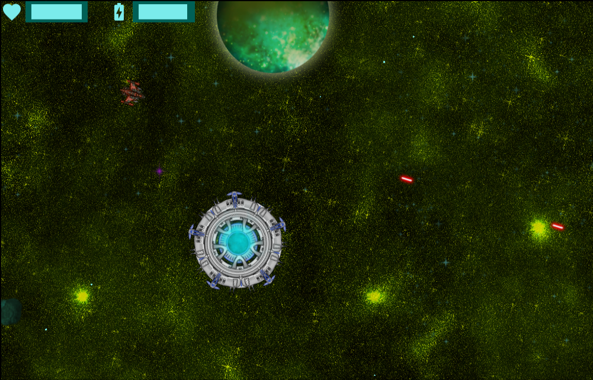
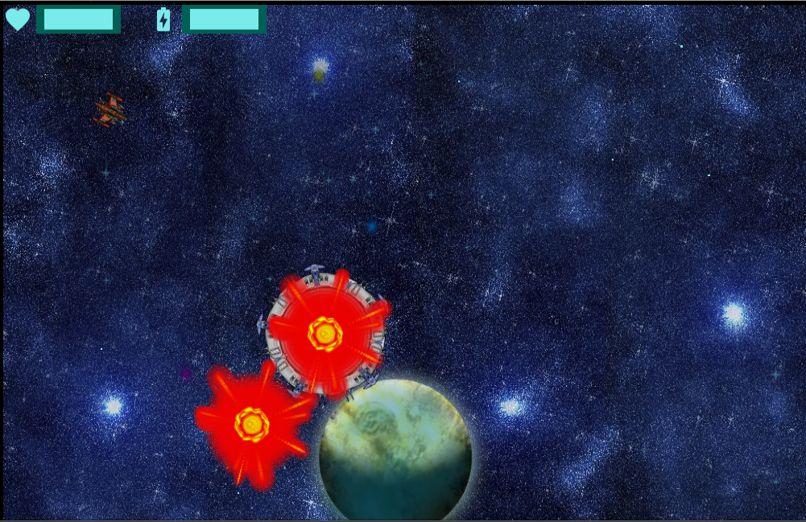
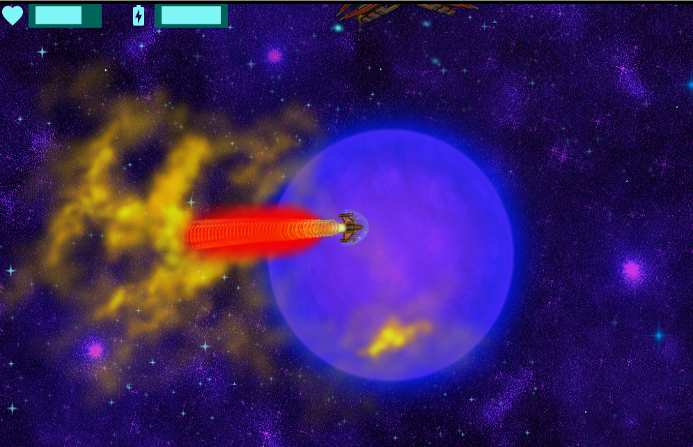
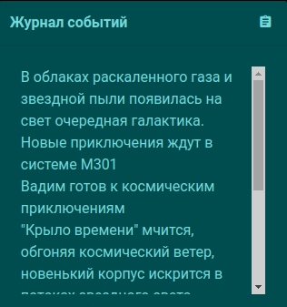

##### Galaxy, Phaser2 practice.

####DON'T USE THIS - experimental repository

####Repository not maintained.

Тестовый проект, заморожен в ожидании Phaser 3.

* Только в целях экспериментов с архитектурой и практики. Прототип.
* В мире есть объекты (для более удобной манипуляции с нативными спрайтами и группами реализованы как врапперы) и правила взаимодействия между объектами, события и т.п. - паттерн медиатор. Нативно в разных пулах. При смене мира shared объекты не удаляются из пула и не разрушаются. Игровые "сервисные" классы тоже относятся к игровым объектам и имеют циклическую ссылку: звук, ассеты, gui и т.п. Имеют такие же методы как и игровые объекты, но пока отделены и не сохраняются в пулах, указанных выше.
* Рутовый класс формирует зависимости, запускает контроллер, который формирует State, передает им зависимости, слушатели событий смерти игрока.
* State формирует пул объектов-врапперов, правил. Большая часть методов игровых объектов запускается в блоках try... catch, при исключении объект или правило удаляется из пула, для предупреждения остановки игры. В т.ч. для этого во многих правилах есть проверки наличия объектов.
* Всё инкапсулировано в "сервисы" в т.ч. для исключения изменения конструкторов во всей иерархии классов при изменениях.
* При входе в новую сгенерированную систему слышны звуки взрывов - это не глюк (как-бы), а разрушение астероидов рядом со звездой.
* Правило повреждений следит за пулами объектов-дамагеров и уязвимых объектов. Оно отделено от другого правила - "смерти", которое наблюдает за пулом и удаляет объекты с нулевым здоровьем, вызывая к тому же визуальный метод разрушения на враппере.
* Консоль - Tab. Спавн по имени враппера, врапперы имеют метод spawn(x,y) с побочным эффектом добавления в группу. Таким образом, при создании астероида или портала - на него будут действовать все правила, обращенные на группу,  разрушение\повреждение\телепорт и т.п.

Ассеты:
http://soundimage.org
https://opengameart.org/content/space-ship-construction-kit
https://opengameart.org/content/set-faction10-spacestations
https://opengameart.org/content/set-faction9-spacestations
https://opengameart.org/content/sci-fi-effects
https://opengameart.org/content/2d-explosion-animations-frame-by-frame
https://opengameart.org/content/2d-explosion-animations-2-frame-by-frame
https://opengameart.org/content/20-planet-sprites
и другие
